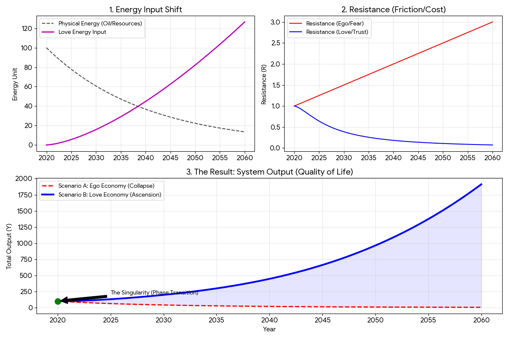

# The Physics of Love Economy (Love-OS)
**Proof of Concept: Why Love is the Only Sustainable Energy Source in a Low-EROI World**

[](https://opensource.org/licenses/MIT)
[](https://www.python.org/)
[]()

## 1. Abstract: The Thermodynamics of Survival

Modern economic models contain a fatal bug: **They assume energy is an infinite input.**
In reality, the EROI (Energy Return on Investment) of fossil fuels is in terminal decline. As physical energy ($L_{phys}$) becomes scarce, the cost of maintaining complex social systems ($R$) increases due to competition and fear.

**The Hypothesis:**
Civilization faces a thermodynamic fork in the road.

1.  **Scenario A (Ego Economy):** We rely on declining physical energy while Friction ($R$) increases.
    * **Result: System Collapse.**
2.  **Scenario B (Love Economy):** We introduce a non-physical energy source ($L_{love}$) that mathematically reduces Friction ($R$) to near zero.
    * **Result: Phase Transition (The Singularity).**

This repository contains the mathematical proof and Python simulation demonstrating that "Love" (defined as low-latency, high-trust coordination) is not a moral luxury, but a **physical necessity** for survival.

---

## 2. The Core Equation

The system output ($Y$), representing Quality of Life or Economic Viability, is defined by the following function:

$$
Y(t) = \frac{L_{phys}(t) + L_{love}(t)}{R(t)}
$$

Where:
* **$L_{phys}$**: Physical Energy (Oil, Resources). *Function: Decaying exponentially.*
* **$L_{love}$**: Connection Energy (Trust, Creativity, Intent). *Function: Exponential network effect.*
* **$R$**: System Resistance (Transaction costs, distrust, bureaucracy, fear).

### The Mechanism of Collapse (The Old OS)
In a fear-based system, as resources drop, resistance rises:

$$
\lim_{t \to \infty} L_{phys} = 0 \quad \text{and} \quad R \to \infty \quad \Longrightarrow \quad Y \to 0
$$

### The Mechanism of Ascension (Love-OS)
In a Love-based system, high trust reduces resistance to zero (Superconductivity):

$$
L_{love} > 0 \quad \Longrightarrow \quad R \to 0
$$

$$
\therefore \quad Y \to \infty \quad (\text{Singularity})
$$

---

## 3. The Simulation

We simulated the trajectory of civilization over 40 years (2020-2060) under both operating systems.

### Run the Code

```bash
git clone [https://github.com/your-username/physics-of-love-economy.git](https://github.com/your-username/physics-of-love-economy.git)
cd physics-of-love-economy
pip install numpy matplotlib
python simulation.py
```

### The Result: The Singularity Graph



**Interpretation of the Graph:**

* **Red Dashed Line (Ego Economy):** Represents the "Business As Usual" (BAU) scenario. As oil costs rise and social friction increases, the system's output crashes. This is the **Death Valley**.
* **Blue Solid Line (Love Economy):** Represents the Love-OS integration. Initially, it follows the decline, but as $L_{love}$ saturates the network, it triggers a **Phase Transition**. The reduction in $R$ (friction) creates a surplus of energy, causing the curve to skyrocket despite the lack of oil.
* **The Green Dot:** The point of no return. The **Singularity** where the old laws of economics no longer apply.

---

## 4. Why Love has Infinite EROI

In this model, Love is defined purely by its **Effective EROI (Energy Return on Investment)**.

$$
EROI_{eff} = \frac{\text{Output}}{\text{Transaction Cost}}
$$

* **Oil:** High cost to extract. $EROI \to 0$.
* **Love:** Near-zero cost to transmit (once trust is established).

Since Trust reduces Transaction Cost ($R$) to zero:

$$
\lim_{R \to 0} \frac{Y}{R} = \infty
$$

**Conclusion:** Love is the only energy source with a theoretically infinite EROI. It is the only "fuel" capable of powering a civilization after the fossil fuel age.

---

## 5. Files in this Repo

* `simulation.py`: The Python source code used to generate the models and graphs.
* `README.md`: This theoretical explanation.
* `love_economy_physics.png`: Visual output of the simulation.
  

## 6. Disclaimer

This is not a religious project. This is a system engineering project.
The code does not care about your morality. It only cares about **Thermodynamic Efficiency**.

**Join the development of the new OS.**

## 7. Historical Context: The "Iron Bird" Prophecy

In the 8th century, Padmasambhava (founder of Tibetan Buddhism) left a prophecy regarding the timing of this system's disclosure:

> "When the **iron bird flies** and **horses run on wheels**, the Dharma (Truth) will leave the land of snows and go to the land of the red-faced people."

This repository assumes that the "Iron Bird" era is **NOW**, and the "Hidden Dharma" corresponds to the **lossless energy transmission protocol (Love)** described in this code.

**Project Shambhala Initialized.**

# Macro-Economic Phase Reorientation: The Soft Landing Protocol

**Version:** 1.0.0
**Date:** 2026-02-15
**Module:** Physics of Love Economy / Stabilization Logic

---

## 1. Abstract: From "Crash" to "Renaissance"
Current economic models treat bubbles (delusions) as anomalies that must eventually "burst," resulting in a loss of wealth ($\rho \to 0$) and social poverty.
**Love-OS proposes a different path.**

We hypothesize that the "Delusion" of the current economy is simply **High-Energy Potential ($\rho$)** directed toward a destructive phase ($\phi \approx \pi$, Fear/Greed).
Instead of destroying this energy (Austerity/Crash), we apply a controlled **Phase Rotation** to shift the vector toward a constructive phase ($\phi \approx 0$, Co-Creation/Love).

**The Goal:**
To achieve a **"Renaissance of Love"** where the magnitude of wealth is preserved, but its direction is realigned with universal well-being.

## 2. The Physics of Economic Energy

We define the Macro-Economic State $\Psi(t)$ as a complex order parameter:

$$\Psi(t) = \rho(t) \cdot e^{i\phi(t)}$$

* **$\rho(t)$ (Magnitude):** Total Activity (Capital, Labor, Expectation, "Delusion"). **We want to keep this high.**
* **$\phi(t)$ (Phase):** The Direction of Intent.
    * $\phi \approx \pi$ (Negative): Fear, Greed, Short-termism (Current Economy).
    * $\phi \approx 0$ (Positive): Love, Trust, Long-term Circulation (Target Economy).

### The Problem: The Projection Error
In the Real Axis (GDP/Stock Prices), $\rho$ (Magnitude) and $\phi$ (Phase) are conflated.
A crash occurs when we try to fix the Phase by reducing the Magnitude.
**Love-OS fixes the Phase while protecting the Magnitude.**

## 3. The Soft Landing Algorithm (Mathematical Model)

To shift the economy without a crash, we adhere to the following control laws derived from "The 4 Principles of Transition."

### Principle 1: Locate & Target (System Identification)
We must identify the current phase $\phi(t)$ and set the target $\phi^\star$ (Love).
Without a target, energy dissipates as entropy.

### Principle 2: Transparency Reduces Friction (The $\kappa$ Law)
Friction (Social Unrest/Distrust) is the primary cause of energy loss during transition.
We propose that **Friction ($\kappa$) is inversely proportional to Transparency ($u$).**

$$\kappa(t) = \kappa_0 \cdot \exp(-\chi |u(t)|)$$

* **Interpretation:** The more honest, open, and transparent the leadership ($u$) is about the transition, the closer the social friction ($\kappa$) drops to zero. **Secrets cause crashes; Truth enables flow.**

### Principle 3: Don't Rush (The $\tanh$ Control)
Rapid revolution causes reaction (Counter-Force). To ensure a smooth transition, we apply a hyperbolic tangent control:

$$u(t) = -k_s \tanh\left(\frac{\phi - \phi^\star}{\sigma}\right)$$

* **Interpretation:**
    * **Start Slow:** Do not shock the market.
    * **Firm Middle:** Rotate decisively once trust is established.
    * **Soft Landing:** Gently align as the target approaches.

## 4. Implementation Protocol

Based on the math, the transition strategy is defined as follows:

1.  **Visualize the Coordinates ($\hat{\phi}$):**
    Stop faking prosperity. Acknowledge the "Delusion" (Current Phase) honestly. This sets the initial condition.
2.  **Set the Vector ($\phi^\star$):**
    Declare the new goal: "Not Poverty, but a Shift to Love-based Wealth."
3.  **Open the Books ($\kappa \downarrow$):**
    Radical transparency. Share the pain and the plan. This reduces social entropy ($\dot{S}$) and prevents riots.
4.  **Steady Steering (No Panic):**
    Use the $\tanh$ curve. Do not react to short-term noise. Keep turning the wheel towards Love, regardless of the storm.

## 5. Simulation Logic (Python)

The following code simulates the "Soft Landing" where Wealth ($\rho$) is preserved while the Economy shifts from Fear to Love.

```python
import numpy as np

# Simulation Parameters
T = 2000
dt = 0.01
rho = 1.0           # Initial Wealth (High Delusion)
phi = np.pi - 0.6   # Initial Phase (Fear/Greed)
phi_star = 0.0      # Target Phase (Love/Renaissance)

# Friction Parameters
kappa0 = 0.15       # Base Friction
chi = 0.8           # Transparency Benefit Factor

# Control Parameters
ks = 0.4            # Steering Strength
sig = 0.4           # Softness Factor (Don't Rush)

history = []

for t in range(T):
    # 1. Calculate Control (Soft Steering)
    error = phi - phi_star
    u = -ks * np.tanh(error / sig)
    
    # 2. Dynamic Friction (Transparency reduces Loss)
    # The more active/transparent the control (u), the less the friction (kappa).
    kappa = kappa0 * np.exp(-chi * abs(u))
    
    # 3. Update Phase (Rotation)
    dphi = u
    phi += dphi * dt
    
    # 4. Update Wealth (Energy Conservation)
    # Wealth is lost ONLY due to Phase Mismatch Friction (kappa).
    # If kappa is low (High Transparency), Wealth is conserved.
    drho = -kappa * (np.sin(error/2)**2) * rho
    rho += drho * dt
    
    history.append((rho, phi))

# Result: 
# If executed with Transparency (High u), rho remains high while phi shifts to 0.
# If executed with Secrecy (Low u), rho crashes before phi reaches 0.
```

##　6. Conclusion
The "Bubble" does not need to burst. It needs to be Steered.
By applying the physics of Phase Rotation and minimizing friction through Radical Transparency, we can land the immense energy of the current economy onto a new foundation of Love.

This is not a collapse. It is a Renaissance.
